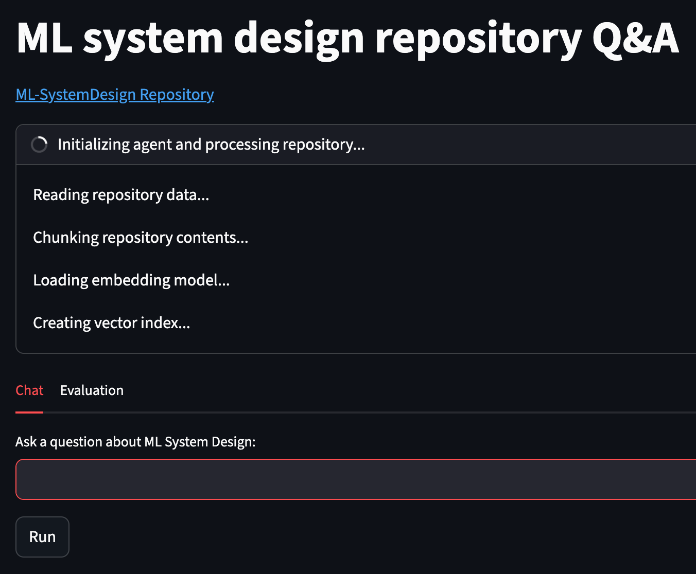
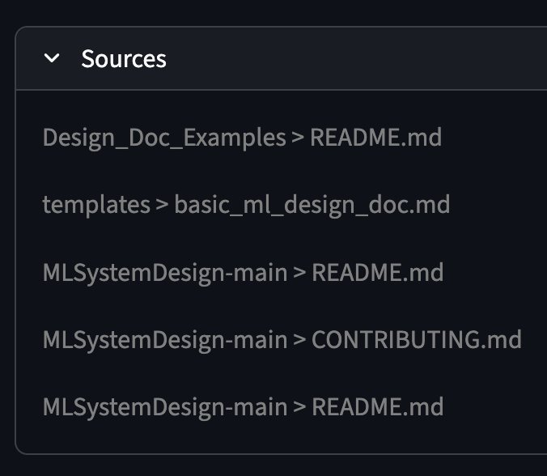

# ML System Design Repository Agent (GraphRAG)

This project is a GraphRAG-based agent designed to answer questions about ML system design based on the [ML System Design](https://github.com/ML-SystemDesign/MLSystemDesign) repository's markdown files.


## Prerequisites

- **Python 3.12+**
- **Docker** (for running Neo4j)
- **uv** (recommended for package management)

## Setup

### 1. Environment Variables

Create a `.env` file in the root directory and add your credentials. You can use `.env.example` as a template:

```bash
cp .env.example .env
```

Edit `.env` to include your `MISTRAL_API_KEY`.

### 2. Run Neo4j Database

You can start the Neo4j database using Docker Compose:

```bash
docker compose up -d
```

Or using a direct docker run command:

```bash
docker run \
    -d \
    --name neo4j_rag \
    -p 7474:7474 -p 7687:7687 \
    -e NEO4J_AUTH=neo4j/password \
    neo4j:latest
```

Wait a few seconds for the database to initialize before running the application.

### 3. Install Dependencies

Using `uv`:

```bash
uv sync
```

## Streamlit UI (Usage)

The project includes a Streamlit-based web interface for an interactive Q&A experience and automated evaluation.

To run the Streamlit app:

```bash
uv run streamlit run src/app.py
```






Navigate to `http://localhost:8501` in your web browser to access the Streamlit interface.


Ask a question and view the sources used to generate the answer:


## Evaluation

The repository features a robust evaluation framework to benchmark agent performance.

### How it Works:

Navigate to the **Evaluation** tab in the Streamlit UI to:


1. **Generate Questions**: Automatically creates test questions based on repository content using an LLM.
2. **Run Benchmark**: Executes the agent on the generated questions.
3. **Analyze Results**: View a detailed breakdown of performance metrics, including passing rates for:
    - instruction_follow
    - answer_relevant
    - answer_clear
    - answer_citations
    - completeness
    - tool_call_search

#### Logic Implementation (`src/eval.py`)

- **Question Generation**: Uses a Mistral model to generate diverse questions from randomly sampled document chunks.
- **Automated Scoring**: An independent `eval_agent` (LLM-based) evaluates the agent's responses against a predefined checklist.

## Why GraphRAG?

Initial attempts using standard Vector RAG proved insufficient for navigating the repository effectively. For example, when asking *"What are the main sections in ML system design doc?"*, a standard RAG system typically retrieves information from `bookOutline.md`. While this file seems relevant, the correct answer is actually located in the example template file.

Standard RAG fails in these cases because it lacks awareness of the folder/file structure and does not even know the names of the files it is searching. This lack of structural context is why the project transitioned to GraphRAG, enabling the agent to understand the repository's organization and retrieve the most accurate information.


