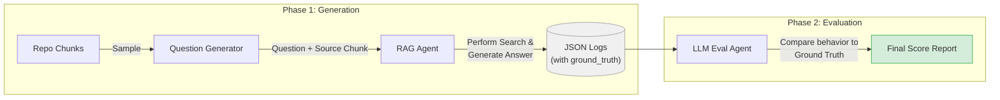

# ML System Design Repository Agent (GraphRAG)

This project is a GraphRAG-based agent designed to answer questions about ML system design based on the [ML System Design](https://github.com/ML-SystemDesign/MLSystemDesign) repository's markdown files.


## Prerequisites

- **Python 3.12+**
- **Docker** (for running Neo4j)
- **uv** (package management)

## Setup

### 1. Environment Variables

Create a `.env` file in the root directory and add your credentials. You can use `.env.example` as a template:

```bash
cp .env.example .env
```

Edit `.env` to include your `MISTRAL_API_KEY`.

### 2. Run Neo4j Database

Using Docker Compose:

```bash
docker compose up -d
```

Wait a few seconds for the database to initialize before running the application.

### 3. Install Dependencies

Using `uv`:

```bash
uv sync
```

## Streamlit UI (Usage)

The project includes a Streamlit-based web interface for an interactive Q&A experience.

To run the Streamlit app:

```bash
uv run streamlit run src/app.py
```


<p align="center">
  
</p>

Navigate to `http://localhost:8501` in your web browser to access the Streamlit interface.

Ask a question and view the sources used to generate the answer:

<p align="center">
  
</p>


## How it works [Under the Hood]

The system operates as an autonomous agent rather than a traditional RAG pipeline.

- **Agentic Decision Making**: Built with `pydantic_ai`, the agent doesn't just "receive" context. It is equipped with a `get_context` tool which it calls autonomously to retrieve repository fragments based on the user's query.
- **Hybrid Search**: When `get_context` is called, it executes an optimized **Cypher query** in Neo4j that performs:
    - **Tri-partite Retrieval**: Searches vector indexes for relevant folders, files, and chunks in a single pass.
    - **Graph-Based Re-ranking**: Automatically "boosts" the score of text chunks if they belong to a folder or file that is also semantically relevant, leveraging the structural links in the knowledge graph.

## Evaluation

The repository features a robust evaluation framework to benchmark agent performance.

### Running Evaluation:

```bash
uv run python src/eval.py
```

### How it Works:

The evaluation runs in two phases:

**Phase 1 — Generate logs**
1. The repository is sliced into chunks and a vector index is built.
2. A random sample of chunks is passed to the `question_generator` LLM. The LLM generates a realistic test question based on each chunk. The question and its exact source chunk (the `ground_truth`) are saved as a pair.
3. ~15% of the test set is injected with artificially unrelated questions (e.g. "How to bake a cake?") to test the agent's ability to gracefully answer "I don't know".
4. The RAG agent answers each question, and the full interaction log (including the `ground_truth` payload) is saved to the `logs/` directory.

**Phase 2 — Judge logs**
5. A separate `eval_agent` (LLM-as-a-Judge) reads each saved log, extracting the explicit `ground_truth` original chunk and the RAG agent's logged behavior.
6. The Judge scores the agent's response across 7 metrics by directly comparing the agent's response and search queries to the known source truth.


```mermaid
flowchart LR
    subgraph "Phase 1: Generation"
        Chunks["Repo Chunks"] -->|Sample| Gen["Question Generator"]
        Gen -->|Question + Source Chunk| Agent["RAG Agent"]
        Agent -->|Perform Search &\nGenerate Answer| Logs[("JSON Logs\n(with ground_truth)")]
    end

    subgraph "Phase 2: Evaluation"
        Logs --> Judge["LLM Eval Agent"]
        Judge -->|Compare behavior to\nGround Truth| Output["Final Score Report"]
    end
    
    style Logs fill:#f0f0f0,stroke:#999
    style Output fill:#d4edda,stroke:#28a745
```

#### Metrics Evaluated:
- **factually_grounded**: Checks if the answer is consistent with the ground truth chunk and gracefully passes if the agent correctly admits "I don't know" when information is deliberately absent.
- **key_information_retrieved**: Checks if the agent successfully surfaced the direct answer to the user's question, based on what the ground truth contained.
- **search_relevance**: Evaluates if the agent's search queries matched the core concepts in the question.
- **citation_accuracy**: Checks if the answer cites specific source filenames rather than vague phrases like "the repository".
- **formatting_compliance**: Checks for appropriate Markdown structure (bullets, bolding).
- **chunk_retrieval_success**: A strict binary check guaranteeing the RAG search explicitly pulled the exact original `filename` that spawned the question.
- **semantic_retrieval_success**: A softer check verifying that *any* of the retrieved chunks contain the same core factual information as the ground truth, gracefully handling redundant knowledge across multiple documents.

#### Example output:

```bash
============================================================
FINAL EVALUATION REPORT
Total Questions Evaluated: 25
------------------------------------------------------------
                    Metric  Score
        factually_grounded  80.0%
 key_information_retrieved  76.0%
          search_relevance  92.0%
         citation_accuracy  20.0%
     formatting_compliance 100.0%
   chunk_retrieval_success  72.0%
semantic_retrieval_success  84.0%
```

## Why GraphRAG?

Initial attempts using standard Vector RAG proved insufficient for navigating the repository effectively. For example, when asking *"What are the main sections in ML system design doc?"*, a standard RAG system typically retrieves information from `bookOutline.md`. While this file seems relevant, the correct answer is actually located in the example template file.

Standard RAG fails in these cases because it lacks awareness of the folder/file structure and does not even know the names of the files it is searching. This lack of structural context is why the project transitioned to GraphRAG, enabling the agent to understand the repository's organization and retrieve the most accurate information.


